# Deepgrade-AI-Grading-System
An automated grading system tool that mitigates individual LLMs drawbacks with AI agent architecture and systems solutions

## Architecture Diagram

## Consistency Rule Engine Architecture

```mermaid
flowchart LR
    A["Flowchart Image Input"] --> B["Extraction Model<br/>(llama3.2-vision)"]
    B --> C["Extract Raw JSON"]
    C --> D["Normalize JSON Structure"]
    D --> E["LLM Node Classification<br/>(granite3.2-vision)"]
    E --> F["Update JSON with Classified Types"]
    F --> G["Graph-Based Logic Evaluation"]
    G --> H["Run Logic Tests:<br/>• Start/End Check<br/>• Decision Condition<br/>• Connectivity<br/>• Sequence Order<br/>• Decision Outcomes<br/>• Self-Loops<br/>• Text Presence"]
    H --> I["Aggregate & Normalize Scores"]
    I --> J["Output Final Score, Details & Updated JSON"]
```

### We use a logic gateway based verificaition of the output before moving along the prompt chaining approach.

## Multi LLM Orchestration Tool Architecture Diagram

## Roadmap
Here's a glimpse of what's on the horizon:
| Feature                                   | Status          |
|-------------------------------------------|-----------------|
| **Website design**       | ✅ Completed    |
| **Setup README.MD**           | ✅ Completed    |
| **LLMs Research**           | ✅ Completed    |
| **Backend Integration**              |  📝 Planned   |
| **Logic Gateway code - Graph Analysis**              |  🔄 In Progress  |
| **FlowCE Evaluation Code (Benchmarking mechanism)**              |  📝 Planned   |
| **Orchestration tool**              |  📝 Planned   |

Status:
✅ Completed
📝 Planned
🔄 In Progress

# Design notes - UI/UX (Faizal)

# Developer notes - LLMs Research (Keertish)

## Setup of ollama and test case
Setup local multi model solution to test quality and responses of model. Downloaded the  llama model with 7b. Now, selecting a image to test out the model. The image is taken from a bigger dataset that primary tested on reasoning of LLM model. This is the repo [FlowCV] (https://github.com/360AILAB-NLP/FlowCE). We took one image which is 

## Tested out on llama
Here's the test response from llama and my comments. 

Hence, we have confirmed that the multi model LLMs on it's own isn't configured for verification and logical validation. Hence, the next step of action is to use the model for it's purpose here being to extract information from the image.

We observe extensive datalose and organization error. Eg. Point 3 is a hallucination. The question branches into only 2 options yet it states that it branches into 3. While the the question itself merges multiple boxes. Extensive summerization and jumping logics leading to higher data loss before moving onto the next stage. Please refer the initial image to notice the failings of the current state of LLMs. 

## Tested out on Gemini 2.0 Flash
We now test out the same sample data on a Gemini 2.0 Flash Powered LLM to see it's response.

As, mentioned the response created a unending cycle within the data extracted. It does improve upon the overall structure but doesn't notice the logical fallacy of an unending loop/cycle. Again as an in depth explaination. 

When "Is the fault rectified?" responses no, it's supposed to go onto the next conditional block being "Does the system receive many TC BPDUs?" but instead it goes back to the "Analyze packet characteristics and filter out attack packets" which in turn creates the loop. We can also attribute that the sample image itself has faults but the general consensus is the flowcharts are stated this way. We could use this as a data point to fine to models to not the irregularity which taking the image as an input. But, the alternative arguement could be that with a better logic based validation or verfication mechanism we could have avoided this mistake.

## Tested out on ChatGPT o3-mini-high
Next, we try out the sample image in a ChatGPT o3-mini-high  The data extraction phase does solve the error noticed in Gemini 2.0 Flash model. The model does a great data extraction phase. It passes my human validation of all conditional points and flow. It also gives a great response on the verification and validation front. 

## Tested out on llama3.2-vision 11b model

The extraction worked well and held onto the reasoning aspect as well. We can proceed with chain of thought reasoning from this output. We can also validate the input + image prompt on the llama3.2vision 11b model as well. Then compare the improvements in a multi llm orchestration scenario.

## Developer Notes - Frontend (Esha)
Version 1:

Version 2:

